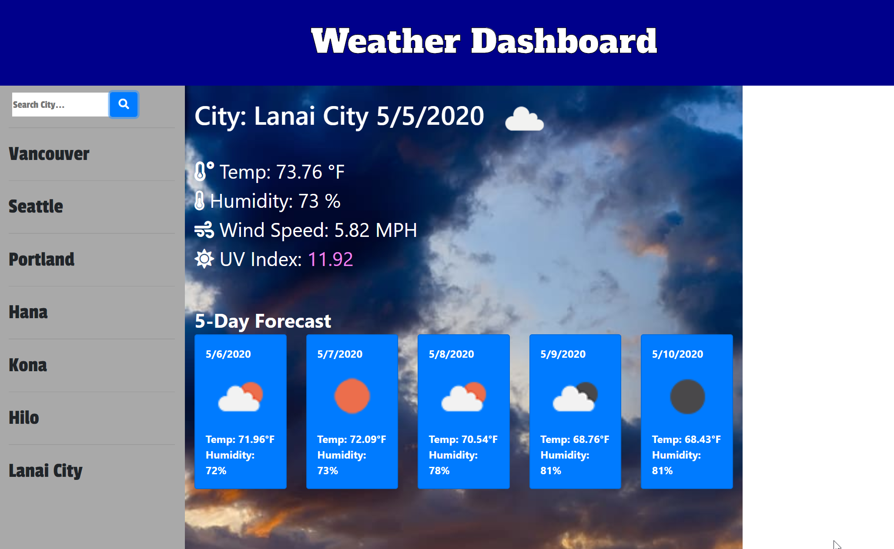

# Weather-Forecast

## User Story
AS a frequent traveler, I WANT to know what the weather will be like in any city I travel to, SO THAT I can better prepare myself for my stay in the city.

## Description
This app is connected to a weather API that will generate the weather presently, and show a 5 day forecast for a chosen city by the user.  It will show the temperature, humidity, windspeed, and uv index. This search extends to any city in the world.  If the city doesn't exist in the API, it will not perform a weather search.

## Deployment
- Clone repo onto your machine
- Open up web browser from `index.html`.
- You can also view a live page at: https://equilinquin.github.io/Weather-Forecast/

## Built with
- HTML
- CSS
- jQuery

## Images of deployed site

